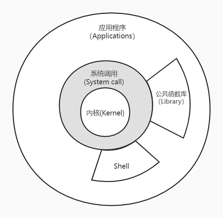

## 1. UNIX基础知识

### 1.1 体系结构



说明：
- 内核提供的接口称为系统调用，公共函数库和Shell构建在系统调用之上。
- 应用程序既可以使用系统调用也可以使用公共函数库，Shell是一个特殊的程序，为运行其他应用程序提供接口/环境。
- Linux是内核，GNU/Linux是操作系统。

### 1.2 登录

登录名：位于口令文件`/etc/passwd`，`:`分隔的7个字段，登录名、加密口令、用户ID、用户组ID、注释、起始目录、Shell程序。
```
root:x:0:0:root:/root:/bin/bash
```
Shell：shell是一个命令行解释器，读取用户输入，执行命令。用户输入通常来自于终端键入或者文件（Shell脚本）。系统从口令文件最后一个字段了解到要执行哪一个shell。常见的Shell：
- `/bin/sh` Bourne shell
- `/bin/bash` Bourne-again shell
- `/bin/csh` C shell
- `/bin/ksh` Korn shell
- `/bin/tcsh` TENEX C shell
- 功能各有不同，Linux默认常用`bash`，所有Unix都提供`sh`，后续的实例都会使用所有shell通用的功能。

### 1.3 文件与目录

文件系统：
- 根（Root）目录：`/`
- 目录是包含目录项的文件，每个文件除了文件名还包含文件属性信息：文件类型（目录或文件）、文件大小、所有者、权限、最后修改时间等信息。
- 目录项的逻辑视图与其存储在磁盘上的逻辑视图不同。

文件名：
- `/`和空字符不能出现在文件名中。
- `/`用来分隔构成路径的目录，空字符用来终止一个路径（C风格字符串）。
- 习惯上只使用常用印刷字符的子集作为文件名。POSIX.1推荐字符集合：`a~zA~Z0~9.-_`。
- 创建新目录时自动创建`.`指向当前目录和`..`指向父目录，`/`中`..`与`.`相同。

路径：
- 绝对路径：`/`开头。
- 相对路径：不以`/`开头，相对于当前工作目录。

工作目录：
- 每个进程都有一个工作目录（working directory），也称当前工作目录（cwd，current working directory）。
- 所有相对路径都相对于工作目录开始解释。
- 进程可以使用`chdir`函数更改其工作目录。

起始目录：
- 登录时，工作目录设置为起始目录/家目录（home directory），从口令文件中获得。

## 1.4 输入输出

文件描述符：
- file descriptor， 通常是一个小的非负整数，内核以此来标识一个特定进程正在打开的文件。
- 当内核创建一个新文件或者打开一个现有文件时创建都会返回一个文件描述符，读写文件时使用。

标准输入、标准输出、标准错误：
- 运行一个新程序时，所有shell都为其打开3个文件描述符。标准输入（standard input），标准输出（standard output），标准错误（standard error），他们的文件描述符分别是0、1、2，于头文件`<unistd.h>`中定义。
- 不做特殊处理的话他们都链接到终端。
- 可以对其中的一个或多个重定向到某个文件。如：
```bash
ls > list.txt 2> err.txt
```
- 使用`> >> 2> 2>> 2>&1`等用来以覆盖和叠加方式重定向输出，或者将错误重定向到标准输出之类，`< <<`输入重定向。
- 标准输入时，Ctrl+D键入文件结束符（EOF）。
0
不带缓冲的IO：
- 函数`open read write lseek close`提供，位于`<unistd.h>`，他们使用文件描述符。
- 不带缓冲。

标准IO：
- 标准IO函数为那些不带缓冲的函数提供一个带缓冲的接口，无需担心如何选取缓冲区大小。
- `putc fgets printf`等函数，头文件`<stdio.h>`，标准IO常量`stdin stdout stderr`（`FILE *`类型），`EOF`常量（值为-1）。

## 1.5 程序和进程

程序：
- 程序（program）是一个存储在磁盘上的可执行文件。
- 内核使用`exec`将程序读取内存，并执行。执行是将当前进程使用`exec`中传入的进程替换。通常在子进程（使用`fork`创建子进程）中调用。

进程：
- 程序的执行实例叫做进程（Process），某些操作系统也称其为任务（task）。
- UNIX系统确保每个进程都有一个唯一的数字标识符，称为进程ID（process ID），用`getpid()`获取，总是一个非负整数。

进程控制：
- 3个用于进程控制的系统调用：`fork exec waitpid`，`exec`有7中变体，统称`exec`函数。
- 其中`fork`用于创建子进程，`waitpid`用于等待子进程结束，`exec`用于执行子进程。

线程：
- 一个进程可以有多个线程（thread）。
- 一个进程内所有线程共享进程的同一地址空间、打开文件的描述符、以及进程相关属性，而线程的栈、寄存器状态、错误码`errno`等则是线程独有的。
- 访问共享数据时需要采用同步措施以保证一致性。
- 线程用线程ID标识，仅在进程内起作用。
- 线程模型引入较进程模型而言较晚，两者之间存在复杂的交互。

## 1.6 错误处理

错误：

函数：

出错恢复：

## 1.7 用户标识

用户ID：

组ID：

附属组ID：

## 1.8 信号

