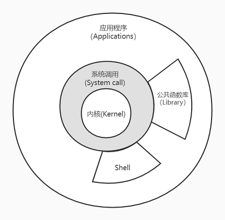

## 1. UNIX基础知识

### 1.1 体系结构



说明：
- 内核提供的接口称为系统调用，公共函数库和Shell构建在系统调用之上。
- 应用程序既可以使用系统调用也可以使用公共函数库，Shell是一个特殊的程序，为运行其他应用程序提供接口/环境。
- Linux是内核，GNU/Linux是操作系统。

### 1.2 登录

登录名：位于口令文件`/etc/passwd`，`:`分隔的7个字段，登录名、加密口令、用户ID、用户组ID、注释、起始目录、Shell程序。
```
root:x:0:0:root:/root:/bin/bash
```
Shell：shell是一个命令行解释器，读取用户输入，执行命令。用户输入通常来自于终端键入或者文件（Shell脚本）。系统从口令文件最后一个字段了解到要执行哪一个shell。常见的Shell：
- `/bin/sh` Bourne shell
- `/bin/bash` Bourne-again shell
- `/bin/csh` C shell
- `/bin/ksh` Korn shell
- `/bin/tcsh` TENEX C shell
- 功能各有不同，Linux默认常用`bash`，所有Unix都提供`sh`，后续的实例都会使用所有shell通用的功能。

### 1.3 文件与目录

文件系统：
- 根（Root）目录：`/`
- 目录是包含目录项的文件，每个文件除了文件名还包含文件属性信息：文件类型（目录或文件）、文件大小、所有者、权限、最后修改时间等信息。
- 目录项的逻辑视图与其存储在磁盘上的逻辑视图不同。

文件名：
- `/`和空字符不能出现在文件名中。
- `/`用来分隔构成路径的目录，空字符用来终止一个路径（C风格字符串）。
- 习惯上只使用常用印刷字符的子集作为文件名。POSIX.1推荐字符集合：`a~zA~Z0~9.-_`。
- 创建新目录时自动创建`.`指向当前目录和`..`指向父目录，`/`中`..`与`.`相同。

路径：
- 绝对路径：`/`开头。
- 相对路径：不以`/`开头，相对于当前工作目录。

工作目录：
- 每个进程都有一个工作目录（working directory），也称当前工作目录（cwd，current working directory）。
- 所有相对路径都相对于工作目录开始解释。
- 进程可以使用`chdir`函数更改其工作目录，使用`getcwd`获取工作目录。

起始目录：
- 登录时，工作目录设置为起始目录/家目录（home directory），从口令文件中获得。

### 1.4 输入输出

文件描述符：
- file descriptor， 通常是一个小的非负整数，内核以此来标识一个特定进程正在打开的文件。
- 当内核创建一个新文件或者打开一个现有文件时创建都会返回一个文件描述符，读写文件时使用。

标准输入、标准输出、标准错误：
- 运行一个新程序时，所有shell都为其打开3个文件描述符。标准输入（standard input），标准输出（standard output），标准错误（standard error），他们的文件描述符分别是0、1、2，对应于宏`STDIN_FILENO STDOUT_FILENO STDERR_FILENO`于头文件`<unistd.h>`中定义。
- 不做特殊处理的话他们都链接到终端。
- 可以对其中的一个或多个重定向到某个文件。如：
```bash
ls > list.txt 2> err.txt
```
- 使用`> >> 2> 2>> 2>&1`等用来以覆盖和叠加方式重定向输出，或者将错误重定向到标准输出之类，`< <<`输入重定向。
- 标准输入时，Ctrl+D键入文件结束符（EOF）。

不带缓冲的IO：
- 函数`open read write lseek close`提供，位于`<unistd.h>`，他们使用文件描述符。
- 不带缓冲。

标准IO：
- 标准IO函数为那些不带缓冲的函数提供一个带缓冲的接口，无需担心如何选取缓冲区大小。
- `putc fgets printf`等函数，头文件`<stdio.h>`，标准IO常量`stdin stdout stderr`（`FILE *`类型），`EOF`常量（值为-1）。

### 1.5 程序和进程

程序：
- 程序（program）是一个存储在磁盘上的可执行文件。
- 内核使用`exec`将程序读取内存，并执行。执行是将当前进程使用`exec`中传入的进程替换。通常在子进程（使用`fork`创建子进程）中调用。

进程：
- 程序的执行实例叫做进程（Process），某些操作系统也称其为任务（task）。
- UNIX系统确保每个进程都有一个唯一的数字标识符，称为进程ID（process ID），用`getpid()`获取，总是一个非负整数。

进程控制：
- 3个用于进程控制的系统调用：`fork exec waitpid`，`exec`有7种变体，统称`exec`函数。
- 其中`fork`用于创建子进程，`waitpid`用于等待子进程结束，`exec`用于执行子进程。

线程：
- 一个进程可以有多个线程（thread）。
- 一个进程内所有线程共享进程的同一地址空间、打开文件的描述符、以及进程相关属性，而线程的栈、寄存器状态、错误码`errno`等则是线程独有的。
- 访问共享数据时需要采用同步措施以保证一致性。
- 线程用线程ID标识，仅在进程内起作用。
- 线程模型引入较进程模型而言较晚，两者之间存在复杂的交互。

### 1.6 错误处理

错误：
- UNIX系统函数出错时，如果返回值类型是整数，通常会返回一个负值，如果是指针，那么通常是`NULL`。而且整型变量`errno`（`<errno.h>`）被设置为具有特定信息的值。
- 例如`open`函数出错时返回`-1`，大约存在15种错误原因，`errno`可能有15种不同取值，在`<errno.h>`中定义了若干`E`开头的宏来表示这些常量。

`errno`：
- POSIX和ISO C都将`errno`定义为一个符号，可扩展为可修改的整型左值（lvalue）。可以是一个整型变量，或者返回整型指针的函数调用的解引用。
- 在早期，它的定义大多是这样的：
```c
extern int errno;
```
- 在在多线程环境中，需要每个线程都有属于自己的`errno`，互不干扰，就不能这样定义。例如Linux支持多线程存取`errno`，定义为：
```c
extern int *__errno_location (void) __THROW __attribute_const__;
# define errno (*__errno_location ())
```

相关函数：
- C标准定义了两个函数，用于打印出错信息：
```c
#include <string.h> // strerror
extern char *strerror (int __errnum) __THROW;
```
- 以及：
```c
#include <stdio.h> // perror
extern void perror (const char *__s);
```
- `strerror`将`errno`映射为其出错信息。`perror`根据打印出输入的字符串，加一个冒号和空格后，再输出当前`errno`对应的出错信息，后接一个换行，作用类似于：`printf("message pass to perror: %s\n", strerror(errno));`。

所有错误一览：
- 在本地Linux系统环境中：
- `0`为成功，最大`strerror`有含义的值为`133`，剩下的信息显示为未知错误。
- 通过`errno -l`命令可以列出`errno`所有宏名、取值、和对应`strerror`字符串信息，位于包`moreutils`中需要安装。
- 多说一句，输出内容并没有对齐，写个程序将内容对齐。用Python实现：
```python
#!/usr/bin/env python3
# FormatErrnoListInfo.py
s = input()
while len(s) > 0:
    l = s.split(' ')
    print(l[0] + " "*(15 - len(l[0]) + 1), end = "") # 15 is max length errno macro
    print(l[1] + " "*(3 - len(l[1]) + 1), end = "") # 3 is max length of errno value
    print(" ".join(l[2:]))
    try:
        s = input()
    except:
        break
```
- 执行：`errno -l | ./FormatErrnoListInfo.py`
- 练习代码中同样实现了C版本，整整70行，`errno -l | ./FormatErrnoListInfo`。像这种简单的胶水逻辑用Python实现可谓是大幅提高了生产力，不应该囿于C，后续会持续使用Python实现部分简单的逻辑。
- Linux中`errno`一览：
```
EPERM           1   Operation not permitted
ENOENT          2   No such file or directory
ESRCH           3   No such process
EINTR           4   Interrupted system call
EIO             5   Input/output error
ENXIO           6   No such device or address
E2BIG           7   Argument list too long
ENOEXEC         8   Exec format error
EBADF           9   Bad file descriptor
ECHILD          10  No child processes
EAGAIN          11  Resource temporarily unavailable
ENOMEM          12  Cannot allocate memory
EACCES          13  Permission denied
EFAULT          14  Bad address
ENOTBLK         15  Block device required
EBUSY           16  Device or resource busy
EEXIST          17  File exists
EXDEV           18  Invalid cross-device link
ENODEV          19  No such device
ENOTDIR         20  Not a directory
EISDIR          21  Is a directory
EINVAL          22  Invalid argument
ENFILE          23  Too many open files in system
EMFILE          24  Too many open files
ENOTTY          25  Inappropriate ioctl for device
ETXTBSY         26  Text file busy
EFBIG           27  File too large
ENOSPC          28  No space left on device
ESPIPE          29  Illegal seek
EROFS           30  Read-only file system
EMLINK          31  Too many links
EPIPE           32  Broken pipe
EDOM            33  Numerical argument out of domain
ERANGE          34  Numerical result out of range
EDEADLK         35  Resource deadlock avoided
ENAMETOOLONG    36  File name too long
ENOLCK          37  No locks available
ENOSYS          38  Function not implemented
ENOTEMPTY       39  Directory not empty
ELOOP           40  Too many levels of symbolic links
EWOULDBLOCK     11  Resource temporarily unavailable
ENOMSG          42  No message of desired type
EIDRM           43  Identifier removed
ECHRNG          44  Channel number out of range
EL2NSYNC        45  Level 2 not synchronized
EL3HLT          46  Level 3 halted
EL3RST          47  Level 3 reset
ELNRNG          48  Link number out of range
EUNATCH         49  Protocol driver not attached
ENOCSI          50  No CSI structure available
EL2HLT          51  Level 2 halted
EBADE           52  Invalid exchange
EBADR           53  Invalid request descriptor
EXFULL          54  Exchange full
ENOANO          55  No anode
EBADRQC         56  Invalid request code
EBADSLT         57  Invalid slot
EDEADLOCK       35  Resource deadlock avoided
EBFONT          59  Bad font file format
ENOSTR          60  Device not a stream
ENODATA         61  No data available
ETIME           62  Timer expired
ENOSR           63  Out of streams resources
ENONET          64  Machine is not on the network
ENOPKG          65  Package not installed
EREMOTE         66  Object is remote
ENOLINK         67  Link has been severed
EADV            68  Advertise error
ESRMNT          69  Srmount error
ECOMM           70  Communication error on send
EPROTO          71  Protocol error
EMULTIHOP       72  Multihop attempted
EDOTDOT         73  RFS specific error
EBADMSG         74  Bad message
EOVERFLOW       75  Value too large for defined data type
ENOTUNIQ        76  Name not unique on network
EBADFD          77  File descriptor in bad state
EREMCHG         78  Remote address changed
ELIBACC         79  Can not access a needed shared library
ELIBBAD         80  Accessing a corrupted shared library
ELIBSCN         81  .lib section in a.out corrupted
ELIBMAX         82  Attempting to link in too many shared libraries
ELIBEXEC        83  Cannot exec a shared library directly
EILSEQ          84  Invalid or incomplete multibyte or wide character
ERESTART        85  Interrupted system call should be restarted
ESTRPIPE        86  Streams pipe error
EUSERS          87  Too many users
ENOTSOCK        88  Socket operation on non-socket
EDESTADDRREQ    89  Destination address required
EMSGSIZE        90  Message too long
EPROTOTYPE      91  Protocol wrong type for socket
ENOPROTOOPT     92  Protocol not available
EPROTONOSUPPORT 93  Protocol not supported
ESOCKTNOSUPPORT 94  Socket type not supported
EOPNOTSUPP      95  Operation not supported
EPFNOSUPPORT    96  Protocol family not supported
EAFNOSUPPORT    97  Address family not supported by protocol
EADDRINUSE      98  Address already in use
EADDRNOTAVAIL   99  Cannot assign requested address
ENETDOWN        100 Network is down
ENETUNREACH     101 Network is unreachable
ENETRESET       102 Network dropped connection on reset
ECONNABORTED    103 Software caused connection abort
ECONNRESET      104 Connection reset by peer
ENOBUFS         105 No buffer space available
EISCONN         106 Transport endpoint is already connected
ENOTCONN        107 Transport endpoint is not connected
ESHUTDOWN       108 Cannot send after transport endpoint shutdown
ETOOMANYREFS    109 Too many references: cannot splice
ETIMEDOUT       110 Connection timed out
ECONNREFUSED    111 Connection refused
EHOSTDOWN       112 Host is down
EHOSTUNREACH    113 No route to host
EALREADY        114 Operation already in progress
EINPROGRESS     115 Operation now in progress
ESTALE          116 Stale file handle
EUCLEAN         117 Structure needs cleaning
ENOTNAM         118 Not a XENIX named type file
ENAVAIL         119 No XENIX semaphores available
EISNAM          120 Is a named type file
EREMOTEIO       121 Remote I/O error
EDQUOT          122 Disk quota exceeded
ENOMEDIUM       123 No medium found
EMEDIUMTYPE     124 Wrong medium type
ECANCELED       125 Operation canceled
ENOKEY          126 Required key not available
EKEYEXPIRED     127 Key has expired
EKEYREVOKED     128 Key has been revoked
EKEYREJECTED    129 Key was rejected by service
EOWNERDEAD      130 Owner died
ENOTRECOVERABLE 131 State not recoverable
ERFKILL         132 Operation not possible due to RF-kill
EHWPOISON       133 Memory page has hardware error
ENOTSUP         95  Operation not supported
```
- 而在Windows中，则存在差别，这里仅讨论UNIX环境，不展开讨论差异。
```
errno:  0, string: No error
errno:  1, string: Operation not permitted
errno:  2, string: No such file or directory
errno:  3, string: No such process
errno:  4, string: Interrupted function call
errno:  5, string: Input/output error
errno:  6, string: No such device or address
errno:  7, string: Arg list too long
errno:  8, string: Exec format error
errno:  9, string: Bad file descriptor
errno: 10, string: No child processes
errno: 11, string: Resource temporarily unavailable
errno: 12, string: Not enough space
errno: 13, string: Permission denied
errno: 14, string: Bad address
errno: 15, string: Unknown error
errno: 16, string: Resource device
errno: 17, string: File exists
errno: 18, string: Improper link
errno: 19, string: No such device
errno: 20, string: Not a directory
errno: 21, string: Is a directory
errno: 22, string: Invalid argument
errno: 23, string: Too many open files in system
errno: 24, string: Too many open files
errno: 25, string: Inappropriate I/O control operation
errno: 26, string: Unknown error
errno: 27, string: File too large
errno: 28, string: No space left on device
errno: 29, string: Invalid seek
errno: 30, string: Read-only file system
errno: 31, string: Too many links
errno: 32, string: Broken pipe
errno: 33, string: Domain error
errno: 34, string: Result too large
errno: 35, string: Unknown error
errno: 36, string: Resource deadlock avoided
errno: 37, string: Unknown error
errno: 38, string: Filename too long
errno: 39, string: No locks available
errno: 40, string: Function not implemented
errno: 41, string: Directory not empty
errno: 42, string: Illegal byte sequence
errno: 43, string: Unknown error
errno: 44, string: Unknown error
errno: 45, string: Unknown error
...
```
- 常见值：
```
EACCES          13  Permission denied
ERANGE          34  Numerical result out of range
```

出错恢复：
- `<errno.h>`中出错可分为两类：致命性的非致命性的。
- 致命性错误无法从错误中恢复，最多打印一条消息或者记录到日志中之后退出。
- 而对于非致命性错误，又是可以妥善处理。
- 对于资源相关的非致命性错误的典型恢复操作就是延迟一段时间之后重试。
- 采用合理的错误恢复策略，可以避免程序异常终止，进而改善程序健壮性。